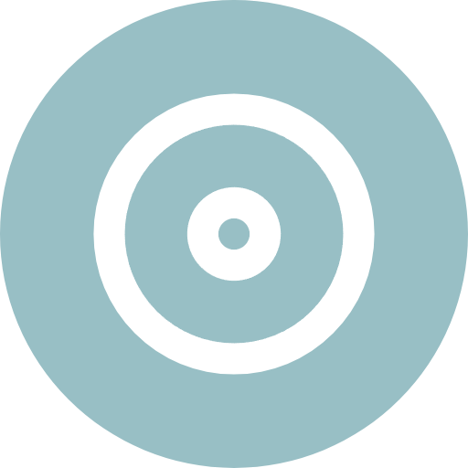

# Welcome to my profile!

## General Info

&nbsp;&nbsp;&nbsp;&nbsp; &nbsp;
Finishing [Henry](https://www.soyhenry.com/carrera-data-science) Full Time Data Science Bootcamp 
&nbsp;&nbsp;&nbsp;&nbsp; &nbsp;
Learning AI image generation (SDXL) 
&nbsp;&nbsp;&nbsp;&nbsp; &nbsp;
Looking for a Jr. role in any data related field 
&nbsp;&nbsp;&nbsp;&nbsp; &nbsp;
*A sucessful life is one where you leave the world better than you found it*

Hello! My name is David. I'm a **passionate** professional practitioner in the data world.

I'm a simple, calm, analytical and strategic person. I love to be **curious** about every topic related to data and technology. My personality spectrum suits very well in a polar bear 🐻‍❄️

I strongly hold on the following 6 **values** as my pillars to perform in any personal or professional relationship:

* Respect
* Honesty
* Solidarity
* Humility
* Kindness
* Goodness

I strive every day to give back and **compensate** society and the environment for everything they have given to me.

Finally, when I'm involved in the development of professional initiatives aligned with my **convictions** and **principles**, I stand out remarkably.

 &nbsp;

 &nbsp;

 &nbsp;

 &nbsp;

 &nbsp;

 &nbsp;

 &nbsp;

## Social Skills

I love to focus everyday in my soft skills because they are game changing when it comes to collaborate with others and succeed in projects.

Some of my social strengths are:

* Active Listening
* Formal, assertive and elaborate communication
* Interpersonal communication
* Leadership and team management
* Proactive engagement
* Team and business role awareness

## Languages

I enjoy learn languages too! Look at the following graph for my learning levels.

* Spanish ⬜⬜⬜⬜⬜⬜⬜
* English &nbsp;⬜⬜⬜⬜⬜⬜
* Chinese ⬜

I'm planning a travel to China for learning more Chinese 💬!

## Design & Patterns

Maybe you noticed in this readme that I'm really detailed oriented. I like to follow visual design patterns, colors and styles because I truly believe in the power of visual communication and expression. All of my developed projects related to Data Analytics follows a cohesive structure and presentation taking in consideration:

* Colors
* Fonts
* Shapes
* Sizes
* Spacing
* UX design

An Image says more than 1000 words so this is an example of data visualization that follows the design patterns of this readme:

Unfortunately I discovered too late how amazing GitHub could be to share your projects, ideas and to cooperate and contribute with others. Nevertheless, I've been active and working on!

  
  

**Disclaimer:** Language Card only shows stats for non-forked repositories (It does not include contributions into another users/organizations repositories sadly)
